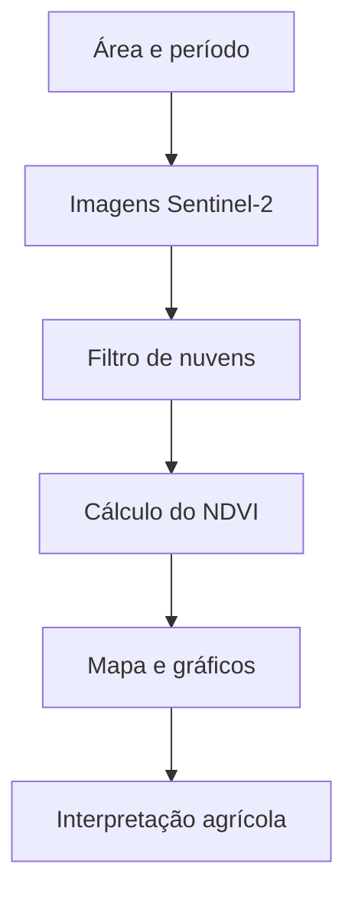

# Análise de Imagens de Satélite Aplicada à Produção de Soja


Projeto acadêmico da disciplina de **Laboratório de Programação**, voltado à análise de áreas produtoras de soja por meio de imagens de satélite e técnicas de geoprocessamento.

## Sobre o projeto

O projeto busca utilizar imagens do satélite **Sentinel-2** para acompanhar áreas agrícolas e identificar diferenças no vigor da vegetação ao longo da safra.

A análise será baseada principalmente no **NDVI (Índice de Vegetação por Diferença Normalizada)**, que utiliza as bandas do vermelho e do infravermelho próximo para destacar áreas com maior ou menor atividade vegetal.

> O NDVI não determina sozinho a produção da lavoura em toneladas. Para estimar produtividade, será necessário combinar as imagens com dados de campo, histórico de produção, clima e características do solo.

## Objetivo geral

Desenvolver uma aplicação em Python capaz de processar e apresentar informações obtidas de imagens de satélite relacionadas ao desenvolvimento de lavouras de soja.

## Objetivos específicos

- Selecionar uma propriedade ou região de interesse;
- Obter imagens gratuitas do Sentinel-2;
- Filtrar imagens por período e cobertura de nuvens;
- Calcular o índice NDVI;
- Exibir a área analisada em um mapa interativo;
- Comparar o comportamento da vegetação em diferentes datas;
- Gerar gráficos e indicadores para auxiliar a interpretação dos resultados.

## Funcionalidades planejadas

- [ ] Seleção da área de análise no mapa;
- [ ] Definição do intervalo de datas;
- [ ] Consulta de imagens Sentinel-2;
- [ ] Filtro de cobertura de nuvens;
- [ ] Cálculo e classificação do NDVI;
- [ ] Visualização do resultado em mapa temático;
- [ ] Comparação entre períodos da safra;
- [ ] Geração de gráficos e resumo estatístico;
- [ ] Exportação dos resultados.

## Tecnologias previstas

| Tecnologia | Utilização |
|---|---|
| Python | Desenvolvimento e processamento dos dados |
| Google Earth Engine | Consulta e processamento de imagens de satélite |
| Sentinel-2 | Fonte gratuita das imagens multiespectrais |
| Streamlit | Interface web da aplicação |
| GeoPandas | Manipulação de dados geográficos vetoriais |
| Rasterio | Processamento de dados raster |
| Folium | Construção do mapa interativo |
| Plotly | Visualização de gráficos e indicadores |

## Metodologia

O funcionamento previsto seguirá estas etapas:

1. O usuário define a área e o período da análise;
2. O sistema consulta imagens Sentinel-2 disponíveis;
3. Imagens com excesso de nuvens são descartadas ou tratadas;
4. As bandas espectrais necessárias são processadas;
5. O NDVI é calculado para cada ponto da área;
6. O resultado é exibido em mapa, gráficos e estatísticas.



## Cálculo do NDVI

O índice é calculado por:

$$
NDVI = \frac{NIR - RED}{NIR + RED}
$$

Para imagens Sentinel-2:

- **NIR:** banda B8 — infravermelho próximo;
- **RED:** banda B4 — vermelho.

Os valores ficam normalmente entre **-1 e 1**. Valores mais altos tendem a representar vegetação mais densa e vigorosa, enquanto valores baixos podem indicar solo exposto, água, ausência de vegetação ou áreas sob estresse.

## Estrutura planejada

```text
.
├── app.py                 # Aplicação Streamlit
├── src/                   # Processamento e regras da análise
├── data/                  # Dados locais de entrada e saída
├── assets/                # Imagens utilizadas na documentação
├── tests/                 # Testes automatizados
├── requirements.txt       # Dependências do projeto
└── README.md              # Documentação principal
```

## Como executar

As instruções abaixo baixam imagens Sentinel-2 para Sinop-MT usando o Google Earth Engine.

### 1. Clonar o repositório

```bash
git clone https://github.com/coldrenatinho/analise-de-imagem-de-satelite-referente-a-producao-de-soja.git
cd analise-de-imagem-de-satelite-referente-a-producao-de-soja
```

### 2. Criar um ambiente virtual

```bash
python -m venv .venv
```

No Windows:

```powershell
.\.venv\Scripts\Activate.ps1
```

No Linux ou macOS:

```bash
source .venv/bin/activate
```

### 3. Instalar as dependências

```bash
pip install -r requirements.txt
```

### 4. Autenticar no Google Earth Engine

Na primeira execução, o script abrirá o fluxo de autenticação do Earth Engine. Também é possível autenticar antes:

```bash
earthengine authenticate
```

Caso sua conta exija um projeto Google Cloud, informe o ID com `--project`.

### 5. Baixar imagens Sentinel-2 de Sinop

```bash
python baixar_sentinel_sinop.py
```

Por padrão, o script consulta a coleção `COPERNICUS/S2_SR_HARMONIZED`, recorta uma área em torno de Sinop-MT, filtra imagens com até 20% de nuvens e salva:

- `data/sentinel/sentinel2_sinop_rgb.tif`
- `data/sentinel/sentinel2_sinop_ndvi.tif`

Também é possível ajustar o período e o filtro de nuvens:

```bash
python baixar_sentinel_sinop.py --start-date 2025-11-01 --end-date 2026-03-31 --max-cloud 10
```

Com projeto Google Cloud:

```bash
python baixar_sentinel_sinop.py --project seu-projeto-google-cloud
```

### 6. Executar a aplicação

```bash
streamlit run app.py
```

## Resultados esperados

Ao final do desenvolvimento, espera-se obter uma aplicação visual capaz de:

- Destacar diferenças no vigor da vegetação;
- Identificar possíveis áreas que mereçam atenção;
- Mostrar a evolução da lavoura entre datas distintas;
- Demonstrar a aplicação prática da programação na agricultura de precisão.

## Limitações

- Nuvens e sombras podem prejudicar a análise;
- O resultado depende da qualidade e da data das imagens;
- O NDVI indica comportamento espectral da vegetação, não a causa de um problema;
- Uma estimativa confiável de produtividade exige dados adicionais e validação em campo.

## Contexto acadêmico

Este repositório será utilizado para organizar o código-fonte, a documentação e os resultados do trabalho de **Laboratório de Programação** sobre análise de imagens de satélite aplicada à cultura da soja.

## Referências

- [Copernicus Data Space Ecosystem](https://dataspace.copernicus.eu/)
- [Documentação do Sentinel-2](https://documentation.dataspace.copernicus.eu/Data/Sentinel2.html)
- [Google Earth Engine](https://earthengine.google.com/)
- [Documentação do Streamlit](https://docs.streamlit.io/)

---

Projeto acadêmico em desenvolvimento.
